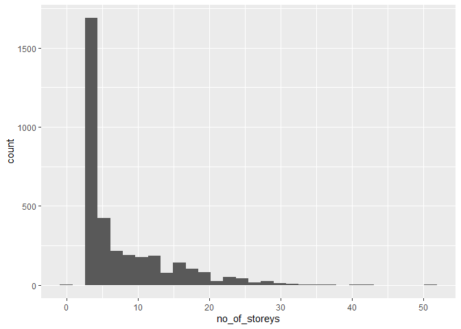
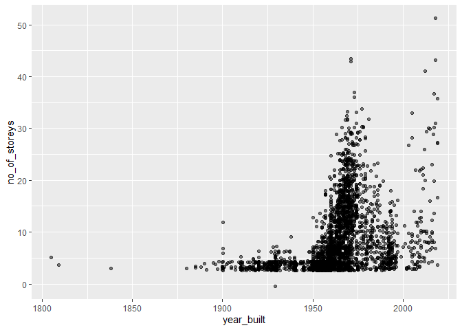
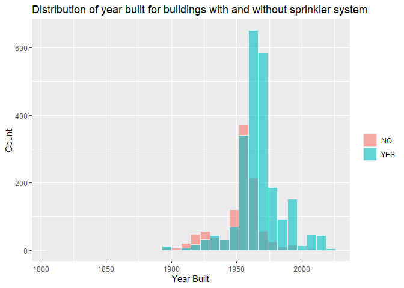
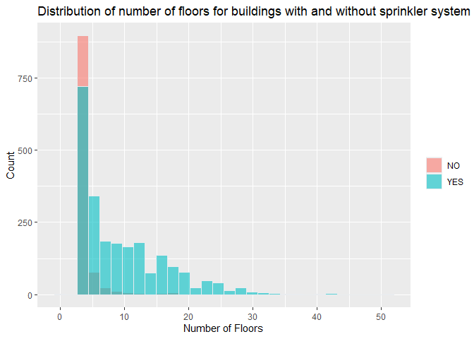
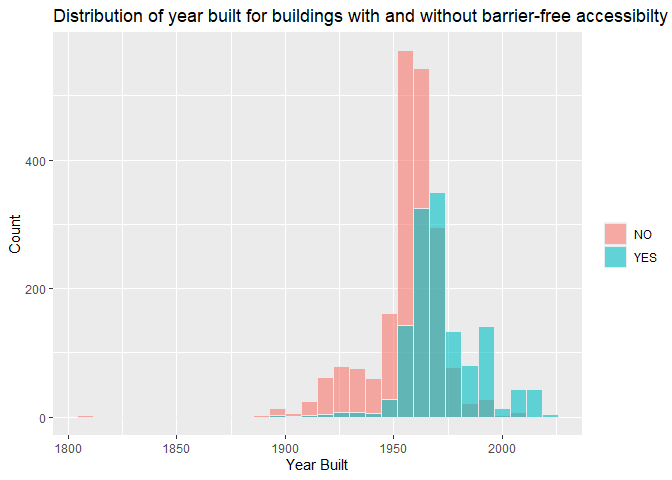
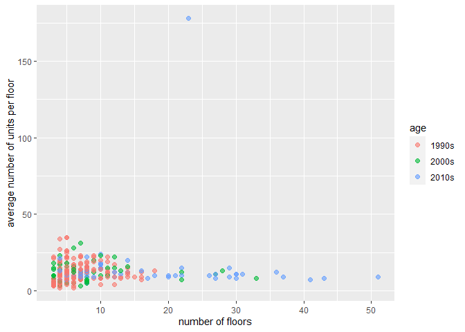

Mini Data-Analysis Deliverable 1
================

# Welcome to your (maybe) first-ever data analysis project!

And hopefully the first of many. Let’s get started:

1.  Install the [`datateachr`](https://github.com/UBC-MDS/datateachr)
    package by typing the following into your **R terminal**:

<!-- -->

    install.packages("devtools")
    devtools::install_github("UBC-MDS/datateachr")

2.  Load the packages below.

``` r
library(datateachr)
library(tidyverse)
```

    ## ── Attaching packages ─────────────────────────────────────── tidyverse 1.3.2 ──
    ## ✔ ggplot2 3.3.6      ✔ purrr   0.3.4 
    ## ✔ tibble  3.1.8      ✔ dplyr   1.0.10
    ## ✔ tidyr   1.2.1      ✔ stringr 1.4.1 
    ## ✔ readr   2.1.3      ✔ forcats 0.5.2 
    ## ── Conflicts ────────────────────────────────────────── tidyverse_conflicts() ──
    ## ✖ dplyr::filter() masks stats::filter()
    ## ✖ dplyr::lag()    masks stats::lag()

3.  Make a repository in the <https://github.com/stat545ubc-2022>
    Organization. You will be working with this repository for the
    entire data analysis project. You can either make it public, or make
    it private and add the TA’s and Lucy as collaborators. A link to
    help you create a private repository is available on the
    \#collaborative-project Slack channel.

# Instructions

## For Both Milestones

- Each milestone is worth 45 points. The number of points allocated to
  each task will be annotated within each deliverable. Tasks that are
  more challenging will often be allocated more points.

- 10 points will be allocated to the reproducibility, cleanliness, and
  coherence of the overall analysis. While the two milestones will be
  submitted as independent deliverables, the analysis itself is a
  continuum - think of it as two chapters to a story. Each chapter, or
  in this case, portion of your analysis, should be easily followed
  through by someone unfamiliar with the content.
  [Here](https://swcarpentry.github.io/r-novice-inflammation/06-best-practices-R/)
  is a good resource for what constitutes “good code”. Learning good
  coding practices early in your career will save you hassle later on!

## For Milestone 1

**To complete this milestone**, edit [this very `.Rmd`
file](https://raw.githubusercontent.com/UBC-STAT/stat545.stat.ubc.ca/master/content/mini-project/mini-project-1.Rmd)
directly. Fill in the sections that are tagged with
`<!--- start your work below --->`.

**To submit this milestone**, make sure to knit this `.Rmd` file to an
`.md` file by changing the YAML output settings from
`output: html_document` to `output: github_document`. Commit and push
all of your work to the mini-analysis GitHub repository you made
earlier, and tag a release on GitHub. Then, submit a link to your tagged
release on canvas.

**Points**: This milestone is worth 45 points: 43 for your analysis, 1
point for having your Milestone 1 document knit error-free, and 1 point
for tagging your release on Github.

# Learning Objectives

By the end of this milestone, you should:

- Become familiar with your dataset of choosing
- Select 4 questions that you would like to answer with your data
- Generate a reproducible and clear report using R Markdown
- Become familiar with manipulating and summarizing your data in tibbles
  using `dplyr`, with a research question in mind.

# Task 1: Choose your favorite dataset (10 points)

The `datateachr` package by Hayley Boyce and Jordan Bourak currently
composed of 7 semi-tidy datasets for educational purposes. Here is a
brief description of each dataset:

- *apt_buildings*: Acquired courtesy of The City of Toronto’s Open Data
  Portal. It currently has 3455 rows and 37 columns.

- *building_permits*: Acquired courtesy of The City of Vancouver’s Open
  Data Portal. It currently has 20680 rows and 14 columns.

- *cancer_sample*: Acquired courtesy of UCI Machine Learning Repository.
  It currently has 569 rows and 32 columns.

- *flow_sample*: Acquired courtesy of The Government of Canada’s
  Historical Hydrometric Database. It currently has 218 rows and 7
  columns.

- *parking_meters*: Acquired courtesy of The City of Vancouver’s Open
  Data Portal. It currently has 10032 rows and 22 columns.

- *steam_games*: Acquired courtesy of Kaggle. It currently has 40833
  rows and 21 columns.

- *vancouver_trees*: Acquired courtesy of The City of Vancouver’s Open
  Data Portal. It currently has 146611 rows and 20 columns.

**Things to keep in mind**

- We hope that this project will serve as practice for carrying our your
  own *independent* data analysis. Remember to comment your code, be
  explicit about what you are doing, and write notes in this markdown
  document when you feel that context is required. As you advance in the
  project, prompts and hints to do this will be diminished - it’ll be up
  to you!

- Before choosing a dataset, you should always keep in mind **your
  goal**, or in other ways, *what you wish to achieve with this data*.
  This mini data-analysis project focuses on *data wrangling*,
  *tidying*, and *visualization*. In short, it’s a way for you to get
  your feet wet with exploring data on your own.

And that is exactly the first thing that you will do!

1.1 Out of the 7 datasets available in the `datateachr` package, choose
**4** that appeal to you based on their description. Write your choices
below:

**Note**: We encourage you to use the ones in the `datateachr` package,
but if you have a dataset that you’d really like to use, you can include
it here. But, please check with a member of the teaching team to see
whether the dataset is of appropriate complexity. Also, include a
**brief** description of the dataset here to help the teaching team
understand your data.

<!-------------------------- Start your work below ---------------------------->

1.  flow_sample  
2.  apt_buildings  
3.  steam_games  
4.  vancouver_trees

<!----------------------------------------------------------------------------->

1.2 One way to narrowing down your selection is to *explore* the
datasets. Use your knowledge of dplyr to find out at least *3*
attributes about each of these datasets (an attribute is something such
as number of rows, variables, class type…). The goal here is to have an
idea of *what the data looks like*.

*Hint:* This is one of those times when you should think about the
cleanliness of your analysis. I added a single code chunk for you below,
but do you want to use more than one? Would you like to write more
comments outside of the code chunk?

<!-------------------------- Start your work below ---------------------------->

In the following section, each dataset will be explored in terms of its
dimension, column names and class type.

1.2.1 flow_sample

``` r
dim(flow_sample)
```

    ## [1] 218   7

``` r
variable.names(flow_sample)
```

    ## [1] "station_id"   "year"         "extreme_type" "month"        "day"         
    ## [6] "flow"         "sym"

``` r
class(flow_sample)
```

    ## [1] "tbl_df"     "tbl"        "data.frame"

1.2.2 apt_buildings

``` r
dim(apt_buildings)
```

    ## [1] 3455   37

``` r
variable.names(apt_buildings)
```

    ##  [1] "id"                               "air_conditioning"                
    ##  [3] "amenities"                        "balconies"                       
    ##  [5] "barrier_free_accessibilty_entr"   "bike_parking"                    
    ##  [7] "exterior_fire_escape"             "fire_alarm"                      
    ##  [9] "garbage_chutes"                   "heating_type"                    
    ## [11] "intercom"                         "laundry_room"                    
    ## [13] "locker_or_storage_room"           "no_of_elevators"                 
    ## [15] "parking_type"                     "pets_allowed"                    
    ## [17] "prop_management_company_name"     "property_type"                   
    ## [19] "rsn"                              "separate_gas_meters"             
    ## [21] "separate_hydro_meters"            "separate_water_meters"           
    ## [23] "site_address"                     "sprinkler_system"                
    ## [25] "visitor_parking"                  "ward"                            
    ## [27] "window_type"                      "year_built"                      
    ## [29] "year_registered"                  "no_of_storeys"                   
    ## [31] "emergency_power"                  "non-smoking_building"            
    ## [33] "no_of_units"                      "no_of_accessible_parking_spaces" 
    ## [35] "facilities_available"             "cooling_room"                    
    ## [37] "no_barrier_free_accessible_units"

``` r
class(apt_buildings)
```

    ## [1] "tbl_df"     "tbl"        "data.frame"

1.2.3 steam_games

``` r
dim(steam_games)
```

    ## [1] 40833    21

``` r
variable.names(steam_games)
```

    ##  [1] "id"                       "url"                     
    ##  [3] "types"                    "name"                    
    ##  [5] "desc_snippet"             "recent_reviews"          
    ##  [7] "all_reviews"              "release_date"            
    ##  [9] "developer"                "publisher"               
    ## [11] "popular_tags"             "game_details"            
    ## [13] "languages"                "achievements"            
    ## [15] "genre"                    "game_description"        
    ## [17] "mature_content"           "minimum_requirements"    
    ## [19] "recommended_requirements" "original_price"          
    ## [21] "discount_price"

``` r
class(steam_games)
```

    ## [1] "spec_tbl_df" "tbl_df"      "tbl"         "data.frame"

1.2.4 vancouver_trees

``` r
dim(vancouver_trees)
```

    ## [1] 146611     20

``` r
variable.names(vancouver_trees)
```

    ##  [1] "tree_id"            "civic_number"       "std_street"        
    ##  [4] "genus_name"         "species_name"       "cultivar_name"     
    ##  [7] "common_name"        "assigned"           "root_barrier"      
    ## [10] "plant_area"         "on_street_block"    "on_street"         
    ## [13] "neighbourhood_name" "street_side_name"   "height_range_id"   
    ## [16] "diameter"           "curb"               "date_planted"      
    ## [19] "longitude"          "latitude"

``` r
class(vancouver_trees)
```

    ## [1] "tbl_df"     "tbl"        "data.frame"

<!----------------------------------------------------------------------------->

1.3 Now that you’ve explored the 4 datasets that you were initially most
interested in, let’s narrow it down to 2. What lead you to choose these
2? Briefly explain your choices below, and feel free to include any code
in your explanation.

<!-------------------------- Start your work below ---------------------------->

The chosen datasets are `apt_buildings` and `steam_games`.

1.3.1 flow_sample

`flow_sample` dataset is not chosen. It has very straight-forward column
names and one can analyze it without expertise in the related area
However, it has very limited number of columns which may make it hard to
extract useful data from it.

1.3.2 apt_buildings

`apt_buildings` dataset is chosen because it contains a variety of
building features and one can find the relationship between year built
and building features and correlation between building features.

``` r
head(apt_buildings)
```

    ## # A tibble: 6 × 37
    ##      id air_co…¹ ameni…² balco…³ barri…⁴ bike_…⁵ exter…⁶ fire_…⁷ garba…⁸ heati…⁹
    ##   <dbl> <chr>    <chr>   <chr>   <chr>   <chr>   <chr>   <chr>   <chr>   <chr>  
    ## 1 10359 NONE     Outdoo… YES     YES     0 indo… NO      YES     YES     HOT WA…
    ## 2 10360 NONE     Outdoo… YES     NO      0 indo… NO      YES     YES     HOT WA…
    ## 3 10361 NONE     <NA>    YES     NO      Not Av… NO      YES     NO      HOT WA…
    ## 4 10362 NONE     <NA>    YES     YES     Not Av… YES     YES     NO      HOT WA…
    ## 5 10363 NONE     <NA>    NO      NO      12 ind… NO      YES     NO      HOT WA…
    ## 6 10364 NONE     <NA>    NO      NO      Not Av… <NA>    YES     NO      HOT WA…
    ## # … with 27 more variables: intercom <chr>, laundry_room <chr>,
    ## #   locker_or_storage_room <chr>, no_of_elevators <dbl>, parking_type <chr>,
    ## #   pets_allowed <chr>, prop_management_company_name <chr>,
    ## #   property_type <chr>, rsn <dbl>, separate_gas_meters <chr>,
    ## #   separate_hydro_meters <chr>, separate_water_meters <chr>,
    ## #   site_address <chr>, sprinkler_system <chr>, visitor_parking <chr>,
    ## #   ward <chr>, window_type <chr>, year_built <dbl>, year_registered <dbl>, …

1.3.3 steam_games

`steam_games` dataset is chosen because I am a game lover myself and I
am interested to see changes in prices over the year and what genres are
popular in certain time period.

1.3.4 vancouver_trees

`vancouver_trees` dataset is not chosen. The dataset has multiple
columns that requires expertise in the area to understand what they
mean.
<!----------------------------------------------------------------------------->

1.4 Time for the final decision! Going back to the beginning, it’s
important to have an *end goal* in mind. For example, if I had chosen
the `titanic` dataset for my project, I might’ve wanted to explore the
relationship between survival and other variables. Try to think of 1
research question that you would want to answer with each dataset. Note
them down below, and make your final choice based on what seems more
interesting to you!

<!-------------------------- Start your work below ---------------------------->

I will choose the `apt_building` dataset because I want to explore the
relationship between year built and building features.

<!----------------------------------------------------------------------------->

# Important note

Read Tasks 2 and 3 *fully* before starting to complete either of them.
Probably also a good point to grab a coffee to get ready for the fun
part!

This project is semi-guided, but meant to be *independent*. For this
reason, you will complete tasks 2 and 3 below (under the **START HERE**
mark) as if you were writing your own exploratory data analysis report,
and this guidance never existed! Feel free to add a brief introduction
section to your project, format the document with markdown syntax as you
deem appropriate, and structure the analysis as you deem appropriate.
Remember, marks will be awarded for completion of the 4 tasks, but 10
points of the whole project are allocated to a reproducible and clean
analysis. If you feel lost, you can find a sample data analysis
[here](https://www.kaggle.com/headsortails/tidy-titarnic) to have a
better idea. However, bear in mind that it is **just an example** and
you will not be required to have that level of complexity in your
project.

# Task 2: Exploring your dataset (15 points)

If we rewind and go back to the learning objectives, you’ll see that by
the end of this deliverable, you should have formulated *4* research
questions about your data that you may want to answer during your
project. However, it may be handy to do some more exploration on your
dataset of choice before creating these questions - by looking at the
data, you may get more ideas. **Before you start this task, read all
instructions carefully until you reach START HERE under Task 3**.

2.1 Complete *4 out of the following 8 exercises* to dive deeper into
your data. All datasets are different and therefore, not all of these
tasks may make sense for your data - which is why you should only answer
*4*. Use *dplyr* and *ggplot*.

1.  Plot the distribution of a numeric variable.
2.  Create a new variable based on other variables in your data (only if
    it makes sense)
3.  Investigate how many missing values there are per variable. Can you
    find a way to plot this?
4.  Explore the relationship between 2 variables in a plot.
5.  Filter observations in your data according to your own criteria.
    Think of what you’d like to explore - again, if this was the
    `titanic` dataset, I may want to narrow my search down to passengers
    born in a particular year…
6.  Use a boxplot to look at the frequency of different observations
    within a single variable. You can do this for more than one variable
    if you wish!
7.  Make a new tibble with a subset of your data, with variables and
    observations that you are interested in exploring.
8.  Use a density plot to explore any of your variables (that are
    suitable for this type of plot).

2.2 For each of the 4 exercises that you complete, provide a *brief
explanation* of why you chose that exercise in relation to your data (in
other words, why does it make sense to do that?), and sufficient
comments for a reader to understand your reasoning and code.

<!-------------------------- Start your work below ---------------------------->

2.2.1 Plot the distribution of a numeric variable.  
As I want to see the relationship between year built and other
variables, I need to know if a building feature is worth exploring by
looking at its distribution.

``` r
ggplot(apt_buildings, aes(no_of_storeys)) + geom_histogram()
```

    ## `stat_bin()` using `bins = 30`. Pick better value with `binwidth`.

<!-- -->

2.2.2 Create a new variable based on other variables in your data (only
if it makes sense)  
I want to know the average number of units per floor so that I can
compute the changes in average number of units per floor over the year.

``` r
apt_buildings_with_upf <- apt_buildings %>%
  drop_na(no_of_units, no_of_storeys) %>%
  mutate(avg_no_of_units_per_floor = floor(no_of_units / no_of_storeys))
apt_buildings_with_upf
```

    ## # A tibble: 3,455 × 38
    ##       id air_c…¹ ameni…² balco…³ barri…⁴ bike_…⁵ exter…⁶ fire_…⁷ garba…⁸ heati…⁹
    ##    <dbl> <chr>   <chr>   <chr>   <chr>   <chr>   <chr>   <chr>   <chr>   <chr>  
    ##  1 10359 NONE    Outdoo… YES     YES     0 indo… NO      YES     YES     HOT WA…
    ##  2 10360 NONE    Outdoo… YES     NO      0 indo… NO      YES     YES     HOT WA…
    ##  3 10361 NONE    <NA>    YES     NO      Not Av… NO      YES     NO      HOT WA…
    ##  4 10362 NONE    <NA>    YES     YES     Not Av… YES     YES     NO      HOT WA…
    ##  5 10363 NONE    <NA>    NO      NO      12 ind… NO      YES     NO      HOT WA…
    ##  6 10364 NONE    <NA>    NO      NO      Not Av… <NA>    YES     NO      HOT WA…
    ##  7 10365 NONE    <NA>    NO      YES     Not Av… NO      YES     NO      HOT WA…
    ##  8 10366 CENTRA… Indoor… YES     NO      Not Av… NO      YES     YES     HOT WA…
    ##  9 10367 NONE    <NA>    YES     YES     0 indo… NO      YES     YES     ELECTR…
    ## 10 10368 NONE    Indoor… YES     YES     Not Av… NO      YES     NO      HOT WA…
    ## # … with 3,445 more rows, 28 more variables: intercom <chr>,
    ## #   laundry_room <chr>, locker_or_storage_room <chr>, no_of_elevators <dbl>,
    ## #   parking_type <chr>, pets_allowed <chr>, prop_management_company_name <chr>,
    ## #   property_type <chr>, rsn <dbl>, separate_gas_meters <chr>,
    ## #   separate_hydro_meters <chr>, separate_water_meters <chr>,
    ## #   site_address <chr>, sprinkler_system <chr>, visitor_parking <chr>,
    ## #   ward <chr>, window_type <chr>, year_built <dbl>, year_registered <dbl>, …

2.2.3 Explore the relationship between 2 variables in a plot.  
As I want to explore the relationship between year built and other
variables, it make sense to have year built in x axis and another
variable in y axis in the plot.

``` r
ggplot(apt_buildings, aes(x = year_built, y = no_of_storeys), na.rm = TRUE) +
   geom_jitter(alpha = 0.5, width = 0.1, na.rm = TRUE)
```

<!-- --> 2.2.4
Filter observations in your data according to your own criteria. Think
of what you’d like to explore - again, if this was the `titanic`
dataset, I may want to narrow my search down to passengers born in a
particular year…  
I want to explore buildings built before 2000 and has more than 10
floors.

``` r
filter(apt_buildings, year_built < 2000, no_of_storeys >= 10)
```

    ## # A tibble: 888 × 37
    ##       id air_c…¹ ameni…² balco…³ barri…⁴ bike_…⁵ exter…⁶ fire_…⁷ garba…⁸ heati…⁹
    ##    <dbl> <chr>   <chr>   <chr>   <chr>   <chr>   <chr>   <chr>   <chr>   <chr>  
    ##  1 10359 NONE    Outdoo… YES     YES     0 indo… NO      YES     YES     HOT WA…
    ##  2 10360 NONE    Outdoo… YES     NO      0 indo… NO      YES     YES     HOT WA…
    ##  3 10367 NONE    <NA>    YES     YES     0 indo… NO      YES     YES     ELECTR…
    ##  4 10375 NONE    <NA>    YES     YES     Not Av… YES     YES     YES     HOT WA…
    ##  5 10377 CENTRA… Indoor… YES     YES     Not Av… NO      YES     YES     HOT WA…
    ##  6 10379 NONE    <NA>    YES     NO      Not Av… YES     YES     YES     HOT WA…
    ##  7 10383 NONE    <NA>    YES     NO      Not Av… NO      YES     YES     HOT WA…
    ##  8 10384 NONE    <NA>    YES     YES     Not Av… YES     YES     YES     HOT WA…
    ##  9 10388 NONE    Outdoo… NO      YES     Not Av… NO      YES     NO      HOT WA…
    ## 10 10391 INDIVI… <NA>    YES     YES     75 ind… NO      YES     YES     HOT WA…
    ## # … with 878 more rows, 27 more variables: intercom <chr>, laundry_room <chr>,
    ## #   locker_or_storage_room <chr>, no_of_elevators <dbl>, parking_type <chr>,
    ## #   pets_allowed <chr>, prop_management_company_name <chr>,
    ## #   property_type <chr>, rsn <dbl>, separate_gas_meters <chr>,
    ## #   separate_hydro_meters <chr>, separate_water_meters <chr>,
    ## #   site_address <chr>, sprinkler_system <chr>, visitor_parking <chr>,
    ## #   ward <chr>, window_type <chr>, year_built <dbl>, year_registered <dbl>, …

<!----------------------------------------------------------------------------->

# Task 3: Write your research questions (5 points)

So far, you have chosen a dataset and gotten familiar with it through
exploring the data. Now it’s time to figure out 4 research questions
that you would like to answer with your data! Write the 4 questions and
any additional comments at the end of this deliverable. These questions
are not necessarily set in stone - TAs will review them and give you
feedback; therefore, you may choose to pursue them as they are for the
rest of the project, or make modifications!

<!--- *****START HERE***** --->

1.  I observed that there are multiple attributes associated with fire
    hazards. I want to research on when do attributes
    (exterior_fire_escape, fire_alarm, sprinkler_system,
    emergency_power, non-smoking_building) become popular among
    buildings.

2.  How does certain properties of the buildings (no_of_elevators,
    no_of_storeys) affect the choices of fire-hazard related features.

3.  I observe that there are several accessibility features. I want to
    research on how these features (barrier_free_accessibilty_entry,
    no_of_accessible_parking_spaces, no_barrier_free_accessible_units)
    become popular over the years.

4.  I want to research on the relationship between year built and number
    of floors and number of units per floor.

# Task 4: Process and summarize your data (13 points)

From Task 2, you should have an idea of the basic structure of your
dataset (e.g. number of rows and columns, class types, etc.). Here, we
will start investigating your data more in-depth using various data
manipulation functions.

### 1.1 (10 points)

Now, for each of your four research questions, choose one task from
options 1-4 (summarizing), and one other task from 4-8 (graphing). You
should have 2 tasks done for each research question (8 total). Make sure
it makes sense to do them! (e.g. don’t use a numerical variables for a
task that needs a categorical variable.). Comment on why each task helps
(or doesn’t!) answer the corresponding research question.

Ensure that the output of each operation is printed!

**Summarizing:**

1.  Compute the *range*, *mean*, and *two other summary statistics* of
    **one numerical variable** across the groups of **one categorical
    variable** from your data.
2.  Compute the number of observations for at least one of your
    categorical variables. Do not use the function `table()`!
3.  Create a categorical variable with 3 or more groups from an existing
    numerical variable. You can use this new variable in the other
    tasks! *An example: age in years into “child, teen, adult, senior”.*
4.  Based on two categorical variables, calculate two summary statistics
    of your choosing.

**Graphing:**

5.  Create a graph out of summarized variables that has at least two
    geom layers.
6.  Create a graph of your choosing, make one of the axes logarithmic,
    and format the axes labels so that they are “pretty” or easier to
    read.
7.  Make a graph where it makes sense to customize the alpha
    transparency.
8.  Create 3 histograms out of summarized variables, with each histogram
    having different sized bins. Pick the “best” one and explain why it
    is the best.

Make sure it’s clear what research question you are doing each operation
for!

<!------------------------- Start your work below ----------------------------->

**Research Question 1:**

*Summarizing: task 2* First I want to find out if any combination of
fire-related facilities is rare or if any two are highly-correlated so
that I can eliminate them for the subsequent analysis.

``` r
apt_buildings %>%
  drop_na(exterior_fire_escape, fire_alarm, sprinkler_system) %>%
  count(exterior_fire_escape, fire_alarm, sprinkler_system, wt=n())
```

    ## Warning: `wt = n()` is deprecated
    ## ℹ You can now omit the `wt` argument

    ## # A tibble: 8 × 4
    ##   exterior_fire_escape fire_alarm sprinkler_system     n
    ##   <chr>                <chr>      <chr>            <int>
    ## 1 NO                   NO         NO                   7
    ## 2 NO                   NO         YES                  2
    ## 3 NO                   YES        NO                 797
    ## 4 NO                   YES        YES               1979
    ## 5 YES                  NO         NO                   2
    ## 6 YES                  NO         YES                  1
    ## 7 YES                  YES        NO                 227
    ## 8 YES                  YES        YES                344

Based on the counts, it is obvious that buildings with no fire alarm are
extremely rare. Therefore, I can ignore this attribute for the
subsequent analysis.

*Graphing: task 7*

``` r
apt_buildings %>%
  drop_na(sprinkler_system, year_built) %>%
  ggplot(aes(x=year_built, fill=sprinkler_system)) +
    geom_histogram( color="#e9ecef", alpha=0.6, position = 'identity') +
    labs(fill="") +
    xlab("Year Built") + 
    ylab("Count") + 
    ggtitle("Distribution of year built for buildings with and without sprinkler system")
```

    ## `stat_bin()` using `bins = 30`. Pick better value with `binwidth`.

<!-- -->

From the graph above, we can see that buildings with sprinkler system
become dominant since around 1960.

**Research Question 2:**

*Summarizing: task 4* I want to find out the relationship between number
of floors and different combination of fire-related facilities.

``` r
apt_buildings %>%
  drop_na(exterior_fire_escape, sprinkler_system, emergency_power, no_of_storeys) %>%
  filter(year_built >= 1950) %>%
  group_by(exterior_fire_escape, sprinkler_system, emergency_power) %>%
  summarise(storeys_median = floor(median(no_of_storeys)),
            storeys_min = min(no_of_storeys),
            storeys_max = max(no_of_storeys))
```

    ## `summarise()` has grouped output by 'exterior_fire_escape', 'sprinkler_system'.
    ## You can override using the `.groups` argument.

    ## # A tibble: 8 × 6
    ## # Groups:   exterior_fire_escape, sprinkler_system [4]
    ##   exterior_fire_escape sprinkler_system emergency_power storey…¹ store…² store…³
    ##   <chr>                <chr>            <chr>              <dbl>   <dbl>   <dbl>
    ## 1 NO                   NO               NO                     3       3      22
    ## 2 NO                   NO               YES                    4       3      29
    ## 3 NO                   YES              NO                     6       3      32
    ## 4 NO                   YES              YES                   11       3      43
    ## 5 YES                  NO               NO                     3       3      13
    ## 6 YES                  NO               YES                    4       3       8
    ## 7 YES                  YES              NO                     5       3      23
    ## 8 YES                  YES              YES                    7       3      51
    ## # … with abbreviated variable names ¹​storeys_median, ²​storeys_min, ³​storeys_max

*Graphing: task 7* I want to know the distribution of number of floors
of buildings with or without sprinkler system.

``` r
apt_buildings %>%
  drop_na(sprinkler_system) %>%
  ggplot(aes(x=no_of_storeys, fill=sprinkler_system)) +
    geom_histogram( color="#e9ecef", alpha=0.6, position = 'identity') +
    labs(fill="") +
    xlab("Number of Floors") + 
    ylab("Count") + 
    ggtitle("Distribution of number of floors for buildings with and without sprinkler system")
```

    ## `stat_bin()` using `bins = 30`. Pick better value with `binwidth`.

<!-- -->

It seems like when the building is taller, sprinkler system is more
necessary.

**Research Question 3:**

*Summarizing: task 2* I want to compute the number of buildings with and
without barrier free accessibility entry after 2000.

``` r
apt_buildings %>%
  filter(year_built >= 2000) %>%
  drop_na(barrier_free_accessibilty_entr) %>%
  count(barrier_free_accessibilty_entr, wt=n())
```

    ## Warning: `wt = n()` is deprecated
    ## ℹ You can now omit the `wt` argument

    ## # A tibble: 2 × 2
    ##   barrier_free_accessibilty_entr     n
    ##   <chr>                          <int>
    ## 1 NO                                11
    ## 2 YES                               99

We can see that most of the buildings built after 2000 has barrier-free
accessibility entry.

*Graphing: task 7*

``` r
apt_buildings %>%
  drop_na(barrier_free_accessibilty_entr, year_built) %>%
  ggplot(aes(x=year_built, fill=barrier_free_accessibilty_entr)) +
    geom_histogram( color="#e9ecef", alpha=0.6, position = 'identity') +
    labs(fill="") +
    xlab("Year Built") + 
    ylab("Count") + 
    ggtitle("Distribution of year built for buildings with and without barrier-free accessibilty entry")
```

    ## `stat_bin()` using `bins = 30`. Pick better value with `binwidth`.

<!-- -->

We can see that barrier-free accessibilty entry became a standard in new
buildings since 1970s.

**Research Question 4:**

*Summarizing: task 3* Since this question involves three numeric data, I
want to convert one of them into categorical data so that it is easier
to plot the data.

``` r
apt_buildings_with_age <- apt_buildings_with_upf %>%
  drop_na(year_built) %>%
  filter(year_built >= 1990, year_built < 2020) %>%
  mutate(age =
           case_when(
             year_built < 2000 ~ "1990s",
             year_built < 2010 ~ "2000s",
             year_built >= 2010 ~ "2010s"))
apt_buildings_with_age
```

    ## # A tibble: 262 × 39
    ##       id air_c…¹ ameni…² balco…³ barri…⁴ bike_…⁵ exter…⁶ fire_…⁷ garba…⁸ heati…⁹
    ##    <dbl> <chr>   <chr>   <chr>   <chr>   <chr>   <chr>   <chr>   <chr>   <chr>  
    ##  1 10385 NONE    <NA>    YES     YES     Not Av… NO      YES     YES     FORCED…
    ##  2 10386 NONE    Indoor… YES     NO      12 ind… NO      YES     YES     HOT WA…
    ##  3 10389 NONE    <NA>    YES     YES     0 indo… NO      YES     NO      HOT WA…
    ##  4 10392 CENTRA… Indoor… YES     YES     71 ind… NO      YES     YES     HOT WA…
    ##  5 10426 CENTRA… Indoor… YES     YES     40 ind… NO      YES     YES     HOT WA…
    ##  6 10438 NONE    Indoor… NO      YES     Not Av… NO      YES     YES     HOT WA…
    ##  7 10444 NONE    <NA>    YES     YES     Not Av… NO      YES     NO      HOT WA…
    ##  8 10453 INDIVI… Indoor… YES     YES     Not Av… NO      YES     YES     ELECTR…
    ##  9 10470 NONE    Indoor… YES     YES     Not Av… NO      YES     YES     HOT WA…
    ## 10 10471 NONE    <NA>    YES     NO      0 indo… NO      YES     NO      ELECTR…
    ## # … with 252 more rows, 29 more variables: intercom <chr>, laundry_room <chr>,
    ## #   locker_or_storage_room <chr>, no_of_elevators <dbl>, parking_type <chr>,
    ## #   pets_allowed <chr>, prop_management_company_name <chr>,
    ## #   property_type <chr>, rsn <dbl>, separate_gas_meters <chr>,
    ## #   separate_hydro_meters <chr>, separate_water_meters <chr>,
    ## #   site_address <chr>, sprinkler_system <chr>, visitor_parking <chr>,
    ## #   ward <chr>, window_type <chr>, year_built <dbl>, year_registered <dbl>, …

As seen above, year_built is limited to the most recent 30 years and
then categorized into three categories each contains 10 years of period.

*Graphing: task 7* Then I want to know the relationship between number
of floors and number of units per floor in different time period.

``` r
ggplot(apt_buildings_with_age, aes(no_of_storeys, avg_no_of_units_per_floor)) +
 geom_point(aes(color = age),
            size = 2,
            alpha = 0.6) + 
  xlab("number of floors") +
  ylab("average number of units per floor")
```

<!-- -->

It appears that the number of floors and the number of units per floor
is not related. Buildings are taller in recent years.

<!----------------------------------------------------------------------------->

### 1.2 (3 points)

Based on the operations that you’ve completed, how much closer are you
to answering your research questions? Think about what aspects of your
research questions remain unclear. Can your research questions be
refined, now that you’ve investigated your data a bit more? Which
research questions are yielding interesting results?

<!-------------------------- Start your work below ---------------------------->

Unfortunately, the tasks listed do not fit well with my research
questions. I got limited insight into the data when doing the
summarizing tasks, whereas the graphing tasks yield some interesting
patterns for the first three questions.

<!----------------------------------------------------------------------------->

### Attribution

Thanks to Icíar Fernández Boyano for mostly putting this together, and
Vincenzo Coia for launching.
